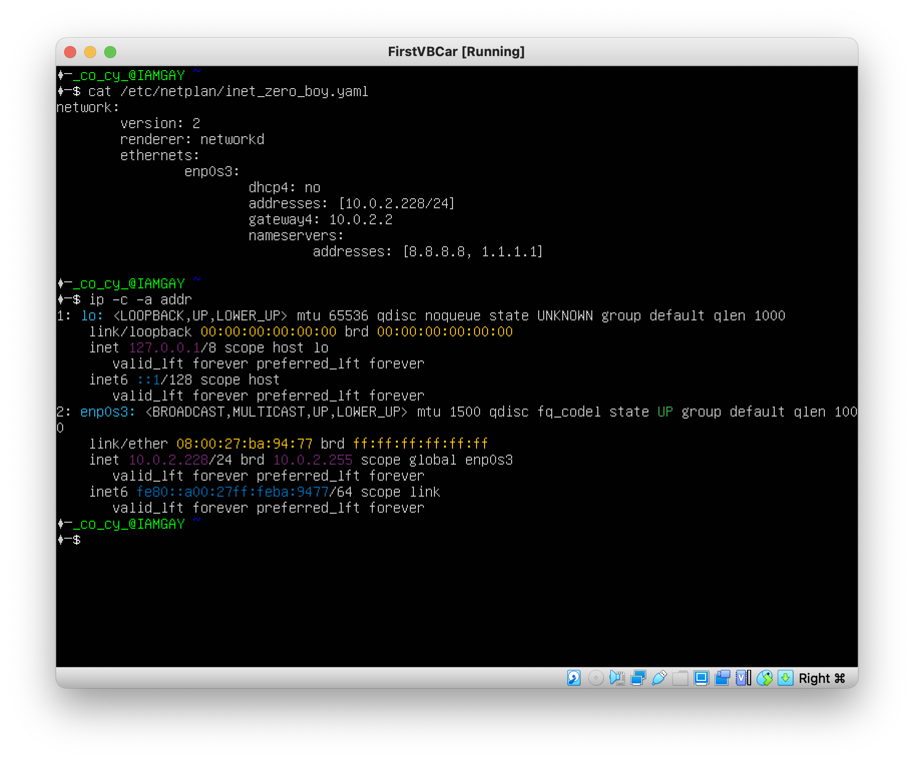
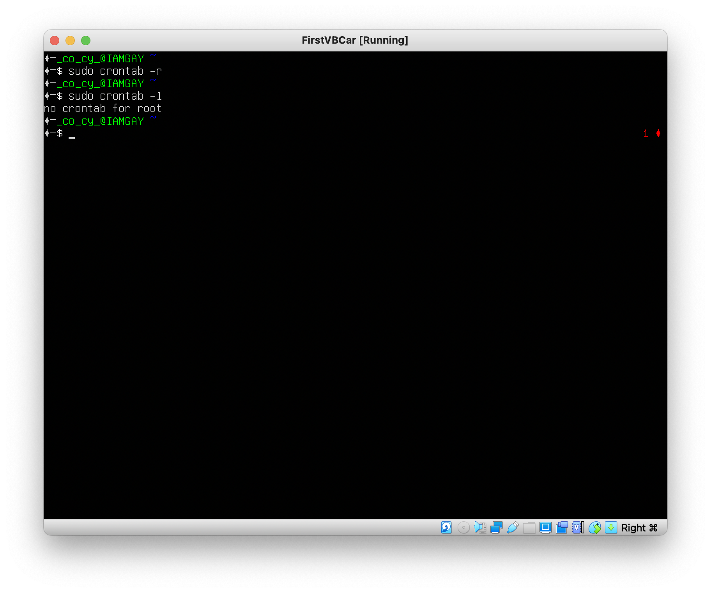

## Part 1. Installation of the OS

    
Выполняем установу Ubuntu 20.4

    
    

    
Убеждаемся что установили нужную версию Ubuntu

    

## Part 2. Creating a user

    
Выполняем команду для создания пользователя

    

    
Выполняем команду для выдачи прав новому пользователю

    

    
ФОТО ПО ТЗ

    

## Part 3. Setting up the OS network

    
Устанавливаем название машине

    

    
Настраиваем и синхронизируем время

    

    
Вывод сетевых интерфейсов с помощью консольной (синим цветом)

    
    
Loopback Interface - это специальный виртуальный сетевой интерфейс, который ваш компьютер использует для связи с самим собой. Он используется в основном для диагностики и устранения неполадок, а также для подключения к серверам, работающим на локальном компьютере. Интерфейс loopback также идентифицируется системой и имеет IP-адрес по умолчанию 127.0.0.1. Его можно просмотреть с помощью команды ip.

    
Вывод вывод нашего ip в сети DHCP

    
    
DHCP - сетевая служба, которая позволяет хост-компьютерам автоматически назначать параметры с сервера, а не вручную настраивать каждый сетевой узел. Компьютеры, настроенные как DHCP-клиенты, не имеют никакого контроля над настройками, которые они получают от DHCP-сервера, и конфигурация прозрачна для пользователя компьютера.

    
ip-адрес шлюза (10.0.2.2)

    

    
Устанавливаю статический IP

    

    
Проверяю связь с серверами

    

## Part 4. OS Update

    
Обновлены все пакеты
         
         " height="600px" src="./images/T8.png"/>

## Part 5. Using the sudo command

    
Выданы права супер пользователя обычному пользователю
         
         " height="600px" src="./images/T9.png"/>

<b>sudo</b> позволяет вызывать команды от другого лица. По умолчанию он вызывает от лица супер пользователя

    
Выданы права супер пользователя обычному пользователю
         
         " height="600px" src="./images/T10.png"/>

## Part 6. Installing and configuring the time service

    
Настраиваем и синхронизируем время

    

## Part 7. Installing and using text editors

    
Установка всех 3-х редакторов

    

### Part 7.1

    
VIM (ESC + ":" + "q" + "w")

    

    
NANO (CTRL + X -> CTRL + Y -> ENTER)

     CTRL + Y -> ENTER)" height="600px" src="./images/T14.png"/>

    
JOE (CTRL + K -> CTRL + X)

     CTRL + X)" height="600px" src="./images/T15.png"/>

### Part 7.2

    
VIM (I + "ENTER MESSAGE" + ESC + ":" + "q" + "!")

    

    
NANO ("ENTER MESSAGE" -> CTRL + X -> CTRL + N)

     CTRL + X -> CTRL + N)" height="600px" src="./images/T17.png"/>

    
JOE (CTRL + C -> Y)

     Y)" height="600px" src="./images/T18.png"/>

### Part 7.3

    
VIM (ESC + ":s/.old_word./.new_word.")

    

    
NANO (CTRL + \ -> .old_word. -> ENTER -> .new_word. -> ENTER -> Y)

     .old_word. -> ENTER -> .new_word. -> ENTER -> Y)" height="600px" src="./images/T20.png"/>

    
JOE (CTRL + K + F -> .old_word. -> ENTER -> R -> ENTER -> .new_word. -> ENTER -> Y -> ENTER)

     .old_word. -> ENTER -> R -> ENTER -> .new_word. -> ENTER -> Y -> ENTER)" height="600px" src="./images/T21.png"/>

## Part 8. Installing and basic setup of the SSHD service

    
Установка и настройка SSHD

    

    
Проверяем наличие процесса sshd

    
    
ps - показывает процессы

    
ps u - показывает процессы пользователя

    
ps u -A - показывает абсолютно все процессы пользователя

    
Вывод netstat -tan

    
    
-t - вывод только tcp портов

    
-a - все порты (как я понял как активные так и пассивные)

    
-n - вывод ip в числовом виде (localhost -> 127.0.0.1)

    
protocol - протокол по которому происходит общение

    
Recv-Q - Счётчик байт не скопированных программой пользователя из этого сокета.

    
Send-Q - Счётчик байтов, не подтверждённых удалённым узлом.

    
Local address - Адрес и номер порта локального конца сокета. Если не указана опция --numeric (-n), адрес сокета преобразуется в каноническое имя узла (FQDN), и номер порта преобразуется в соответствующее имя службы.

    
Foreign address - Адрес и номер порта удалённого конца сокета. Аналогично "Local Address."

    
protocol - протокол по которому происходит общение

    
state - состояние программы на этом порту

    
0.0.0.0 - абсолютно любой адрес сети

## Part 9. Installing and using the top, htop utilities

    
TOP

    

Parameters:

<li>uptime - 5 min</li>
<li>users - 1</li>
<li>total system load - 0.00 / 1m , 0.06 / 5m, 0.04 / 15m</li>
<li>total process -  95</li>
<li>CPU Usage - 0%</li>
<li>Memory Usage - 150 + 336 cached</li>
<li>PID memory - 1</li>
<li>PID cpu - (null)</li>

    
HTOP - sorted PID

    

    
HTOP - sorted CPU

    

    
HTOP - sorted Memory

    

    
HTOP - sorted Time

    

    
HTOP - filter: sshd

    

    
HTOP - search: syslog

    

    
HTOP - with gashi style

    

## Part 10. Using the fdisk utility

    
sudo fdisk -l

    
    
Name - VBOX HARDDISK

    
SIZE - 10 GiB

    
Count sectors - 20971520

    
Swap size (Файл подкачки) - EMPTY

## Part 11. Using the df utility

    
commnad: df

    
    
ALL SIZE - 9336140 kbyte

    
USED size - 2659336 byte

    
Available size - 6182728 byte

    
Percent - 31%

    
commnad: df -Th

    
    
ALL SIZE - 9.0 GiB

    
USED size - 2.6 GiB

    
Available size - 5.9 GiB

    
Percent - 31%

    
Type system - ext4

## Part 12. Using the du utility

    
Output the size of the /home, /var, /var/log folders (in bytes, in human readable format)

    

    
Output the size of all contents in /var/log (not the total, but each nested element using *)

    

## Part 13. Installing and using the ncdu utility

    
Output the size of the /home, /var, /var/log folders.

    

    

    

## Part 14. Working with system logs

    
Write the last successful login time, user name and login method in the report.

    
    
user - gashi_mushi, time - 12:50, method systemd-logind

    
Restart service

    

## Part 15. Using the CRON job scheduler

    
Using the job scheduler, run the uptime command in every 2 minutes.

    

    
Remove all cron

    

