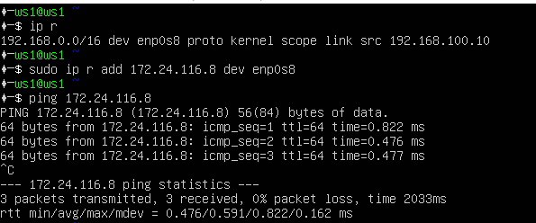

# Linux Network

5.1 - [Инструмент ipcalc](#part-1) \
5.2 - [Статическая маршрутизация между двумя машинами](#part-2) \
5.3 - [Утилита iperf3](#part-3) \
5.4 - [Сетевой экран](#part-4) \
5.5 - [Статическая маршрутизация сети](#part-5) \
5.6 - [Динамическая настройка IP с помощью DHCP](#part-6) \
5.7 - [NAT](#part-7-nat) \
5.8 - [Допополнительно. Знакомство с SSH Tunnels](#part-8)

## Part 1

### 1.1
1) 192.167.38.54/13  
192.160.0.0  
2) 255.255.255.0 
24 = 11111111.11111111.11111111.00000000 
3) /15 
255.254.0.0 = 11111111.11111110.00000000.00000000
4) 11111111.11111111.11111111.11110000 
 255.255.255.240 = 28
5) 12.167.38.4/8 
HostMin:   12.0.0.1 
HostMax:   12.255.255.254 
6) 12.167.38.4/11111111.11111111.00000000.00000000 
HostMin:   12.0.0.1 
HostMax:   12.167.255.254 
7) 12.167.38.4/255.255.254.0 
HostMin:   12.0.38.1 
HostMax:   12.167.39.254 
8) 12.167.38.4/4 
HostMin:   0.0.0.1 
HostMax:   15.255.255.254 

### 1.2
127.0.0.1/8 

TRUE 
- 127.0.0.2
- 127.1.0.1

FALSE 
- 194.34.23.100
- 128.0.0.1

### 1.3
Private:
- 10.0.0.45
- 192.168.4.2
- 172.20.250.4
- 172.16.255.255
- 10.10.10.10

Public:
- 134.43.0.2
- 172.0.2.1
- 192.172.0.1
- 172.68.0.2
- 192.169.168.1

Possible:
- 10.10.0.2
- 10.10.10.10
- 10.10.1.255

Impossible:
- 10.0.0.1
- 10.10.100.1

## Part 2

ip a (ws1)

ip a (ws2)

etc/netplan/00-installer-config.yaml (ws1)

etc/netplan/00-installer-config.yaml (ws2)

sudo netplan apply (ws1)

sudo netplan apply (ws2)

### Part 2.1

ip r add (ws1)

ip r add (ws2)

### Part 2.2

new_netplan (ws1)

ping new_netplan

new_netplan (ws2)

ping new_netplan

## Part 3

### Part 3.1
8 Mbps в MB/s = 1MB/s,  
100 MB/s в Kbps = 800 000 Kbps,  
1 Gbps в Mbps = 1000 Mbps  

### Part 3.2

iperf3 -s - Создание сервера
iperf3 -c <ip> - Подключиться к серверу тестирования

## Part 4

firewall for ws1

firewall for ws2

Apply firewall ws1

Apply firewall ws2

Разница между стратегиями:  
В 1-й стратегии мы разрешаем, а потом пытаемся перезаписать запрещающим правилом. (Но этого не происходит, потому что перезаписывать нельзя) 
Во 2-й мы с начало запрещаем, а потом разрешаем (Но этого не происходит, потому что перезаписывать нельзя) 

### Part 4.2
nmap

## Part 5 

### Part 5.1
etc/netplan/00-installer-config.yaml для всех машин

ws11 ip -4 a

r1 ip -4 a

r2 ip -4 a

ws21 ip -4 a

ws22 ip -4 a

### Part 5.2
sudo sysctl -w net.ipv4.ip_forward=1

sudo vim /etc/sysctl.conf

### Part 5.3
etc/netplan/00-installer-config.yaml для всех машин
(nameservers в ws21 ненужны, а скрин менять мне лень)

ip r

tcpdump

### Part 5.4
etc/netplan/00-installer-config.yaml для всех машин
(nameservers в ws21 ненужны, а скрин менять мне лень)

ip r

ip r list 10.10.0.0/[маска сети] и ip r list 0.0.0.0/0

Если есть какой-то другой путь до сети, путь по умолчанию не будет выбран

### Part 5.5
traceroute

Как работает traceroute. \
1. Traceroute отправляет пакет к точке назначения, устанавливая TTL равным 1;
2. Каждый роутер в маршруте уменьшает значение TTL на единицу, пока TTL не достингнет нуля;
3. Когда TTL становится == 0 то роутер, который отбрасывает этот пакет, отправляет отправителю сообщение ICMP TTL Exceeded , в которое включаются первые 28 байт оригинального “зондирующего” пакета; 
4. Traceroute получает это сообщение и использует разницу во времени между отправкой оригинального пакета и полученным в ответ пакетом ICMP для посчета задержки доставки к этому роутеру/хопу;
5. Процесс повторяется с п. 1, но с TTL увеличенным на 1, пока…. 
6. Окончательный получатель получает пакет от traceroute и отправляет в ответ сообщение, отличное от ICMP TTL Exceeded . Тогда traceroute считает, что трассировка завершена и заверает процесс. 

### Part 5.6
ping -c 1 10.30.0.111

## Part 6
/etc/dhcp/dhcpd.conf

resolv.conf

systemctl restart isc-dhcp-server && ip a

ping ws21 - ws22

macaddress: 10:10:10:10:10:BA, dhcp4: true

r1 dhcp

r1 resolv

r1 restart and ws11 ip a

ws11 dhcp update

## Part 7

apache2 ws22 && r1

ping ws22 && r1

apply icmp

SNAT and DNAT

telnet
