# DO5_SimpleDocker

## Part 1

<figure>
    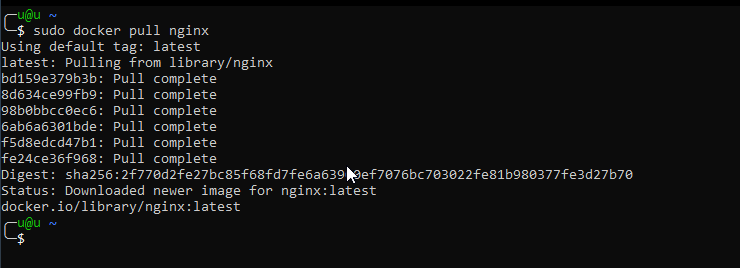
    <figcaption style="text-align: center">docker pull</figcaption>
</figure>

<figure>
    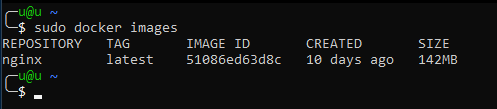
    <figcaption style="text-align: center">docker images</figcaption>
</figure>

<figure>
    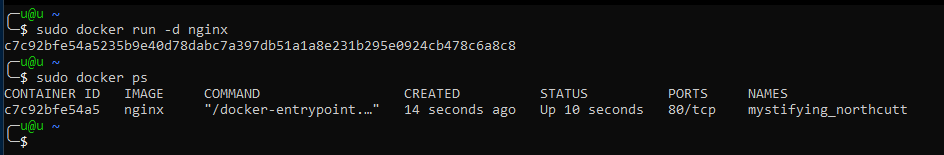
    <figcaption style="text-align: center">docker run and docker ps</figcaption>
</figure>

<figure>
    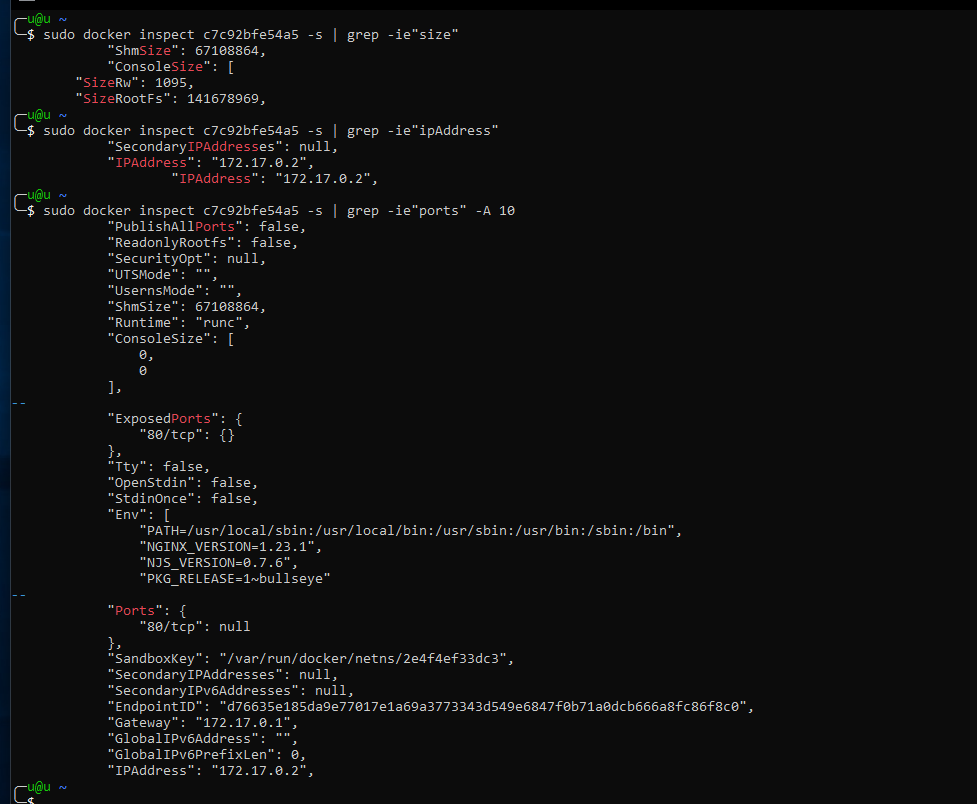
    <figcaption style="text-align: center">docker inspect</figcaption>
</figure>

<figure>
    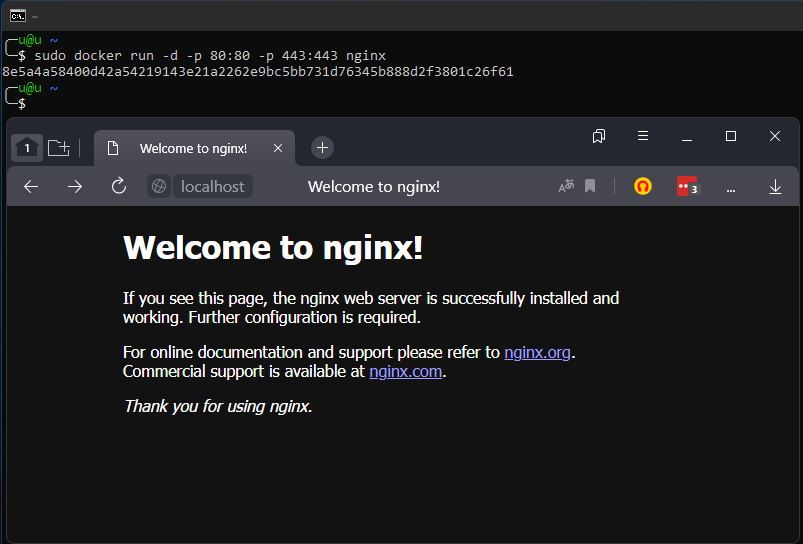
    <figcaption style="text-align: center">docker ports</figcaption>
</figure>

<figure>
    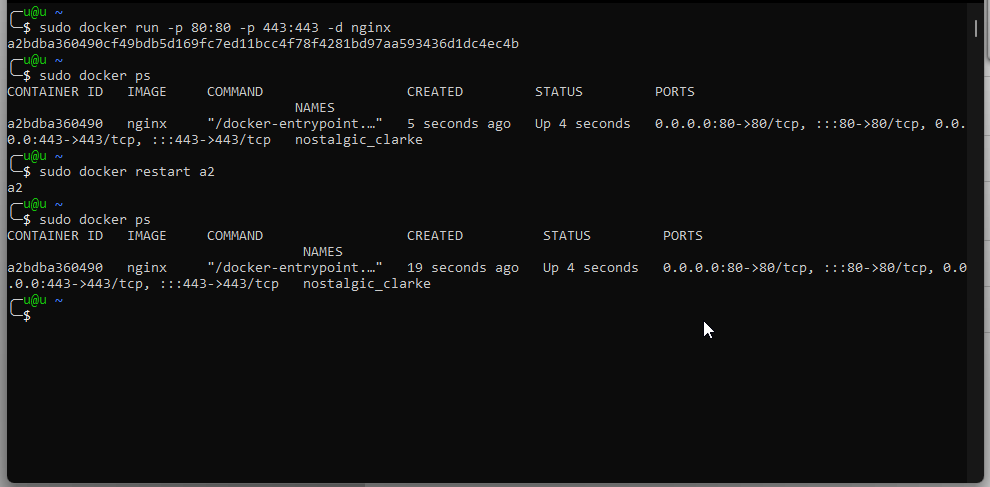
    <figcaption style="text-align: center">docker restart</figcaption>
</figure>

## Part 2

<figure>
    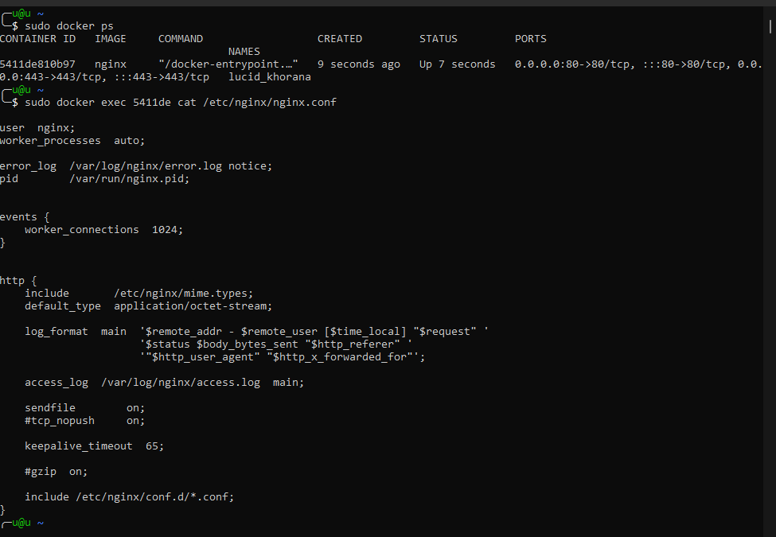
    <figcaption style="text-align: center">docker exec cat nginx</figcaption>
</figure>

<figure>
    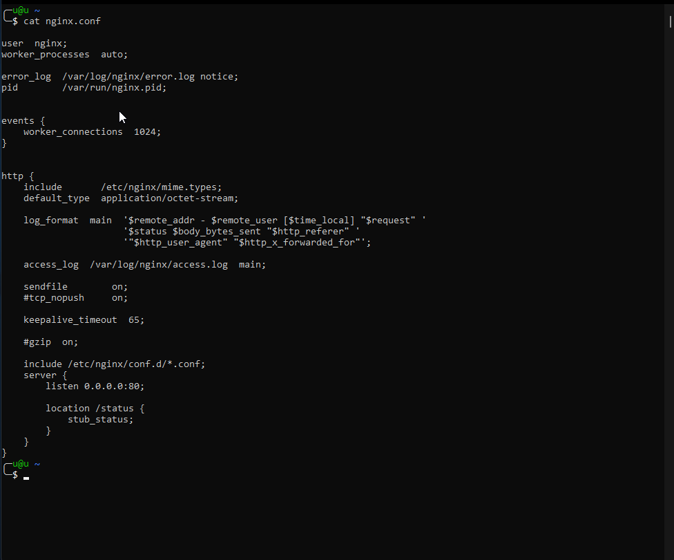
    <figcaption style="text-align: center">docker copy nginx.conf</figcaption>
</figure>

<figure>
    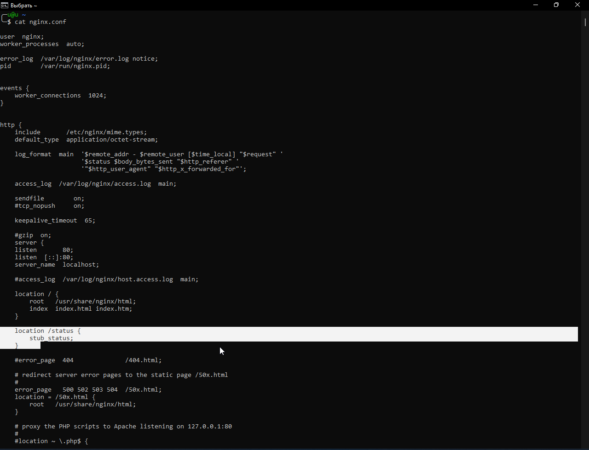
    <figcaption style="text-align: center">nginx.conf</figcaption>
</figure>

<figure>
    
    <figcaption style="text-align: center">nginx status page</figcaption>
</figure>

<figure>
    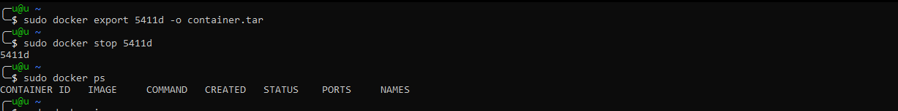
    <figcaption style="text-align: center">docker export and stop</figcaption>
</figure>

<figure>
    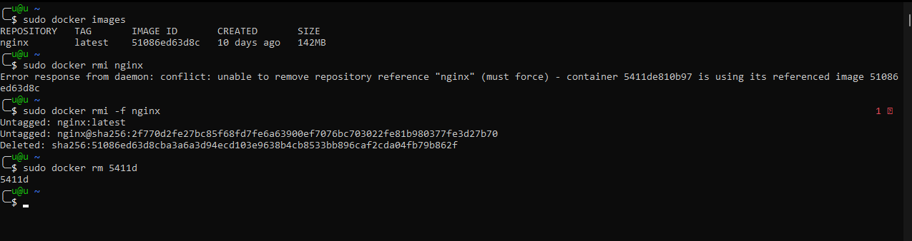
    <figcaption style="text-align: center">docker rmi and docker rm</figcaption>
</figure>

<figure>
    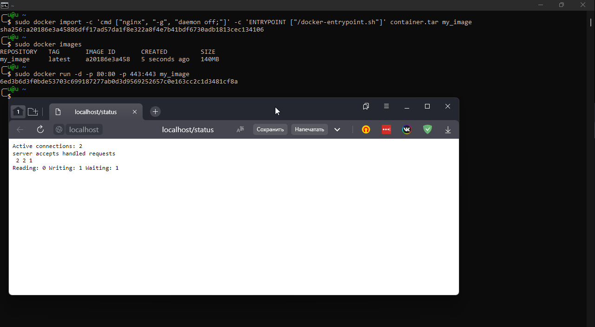
    <figcaption style="text-align: center">docker import and run</figcaption>
</figure>

## Task 3

<figure>
    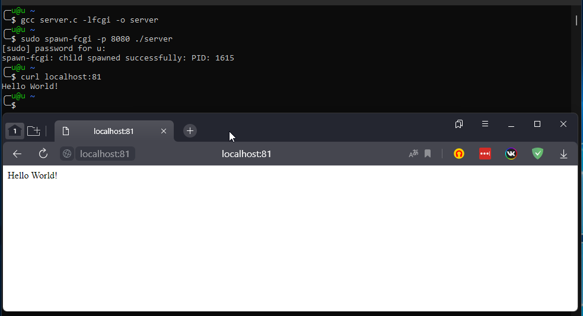
    <figcaption style="text-align: center">create fcgi</figcaption>
</figure>

## Task 4

<figure>
    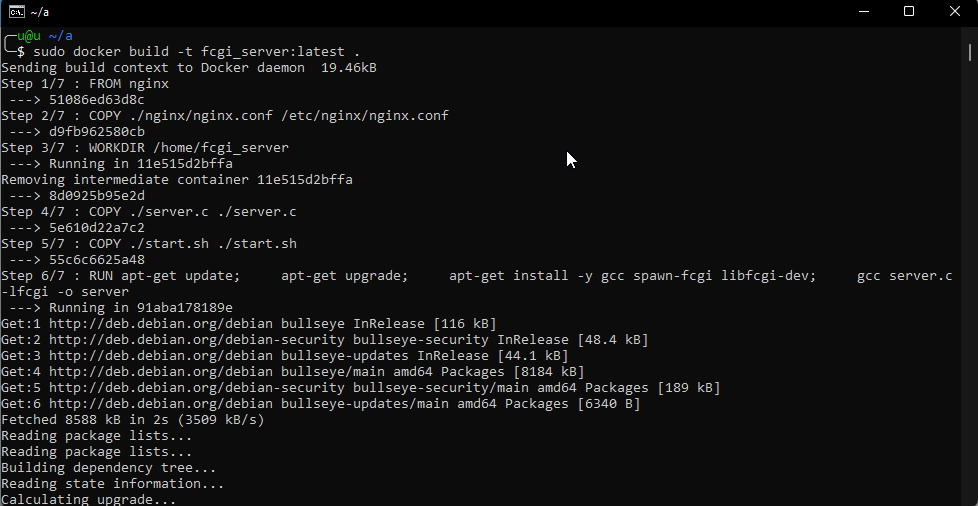
    <figcaption style="text-align: center">build docker and run fcgi</figcaption>
</figure>

<figure>
    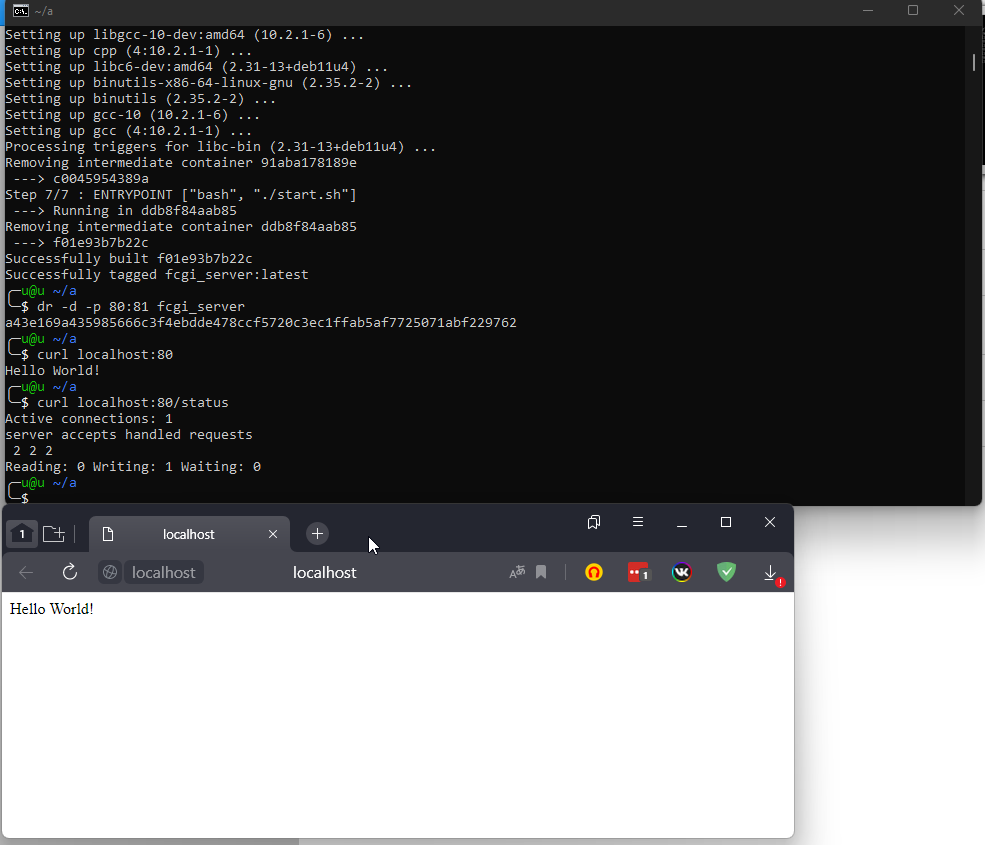
    <figcaption style="text-align: center">build docker and run fcgi</figcaption>
</figure>

## Task 4

<figure>
    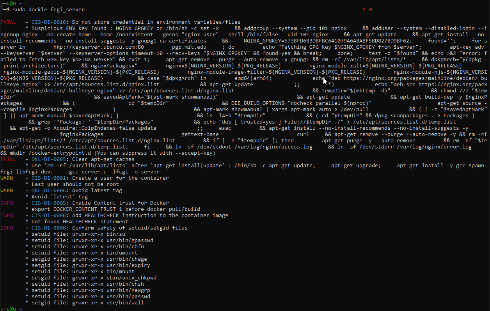
    <figcaption style="text-align: center">dockle before</figcaption>
</figure>

<figure>
    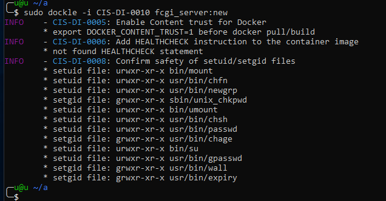
    <figcaption style="text-align: center">dockle after</figcaption>
</figure>

